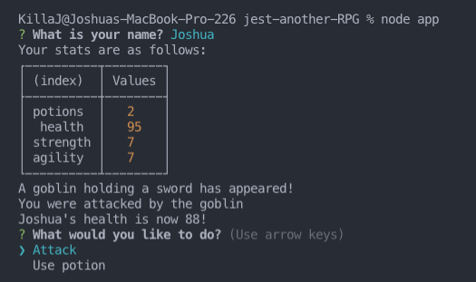
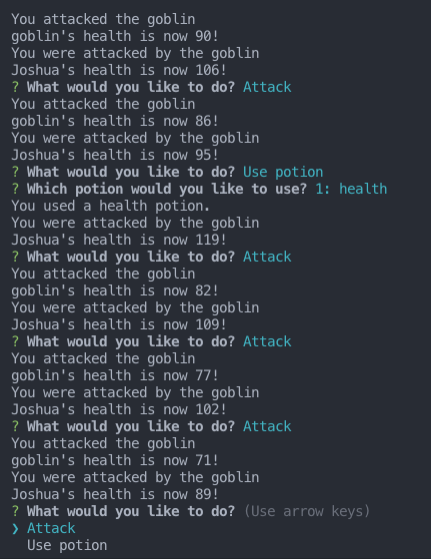

# Jest Another RPG

## Description

Jest Another RPG application, is a node.js based game that is played in the terminal console. Each time the game runs, player is given random stats on health, strength, and agility, and player must combat mythological creates they come across during the game. Player must either attack or use a potion to supplement their health, strength or agility. Game plays until either player wins by defeating all creatures, runs out of potions, or is defeated.

Jest Another RPG was built using object oriented programing (OOP) and Test-Driven Development (TDD), and has been consolidated and refactored using ES6 methodologies.

## Languages

* Node.JS
* NPM - Inquirer & Jest
* Javascript
* ES5/ES6 syntax
* OOP
* TDD

## Functionality
* Implemented test with Jest to verify proper oject creation and method usage

* Created test mock to eliminate dependencies on other modules

* Working command-line game using OOP structure

* Utilized built-in data types (ie. Arrays) to inherit their own methods

* Converted ES5 constructor functions to ES6 classes without interrupting test suites

* Implemented method and property inheritance using both ES5 and ES6 syntax

* Conditional Game logic to follow sequence and restart application until enemies are defeated or player dies and/or runs out of potions

## How to Run The Application

1.) Clone repository to a dedicated repository location on your local git or download files directly via zip file

2.) Open code in dedicated code editor

3.) Open root directory in terminal window

4.) Type NPM install to install dependencies (Inquirer and Jest)

5.) After dependencies are installed, type `node app` in the terminal window, and application will run

## Referenced Image

